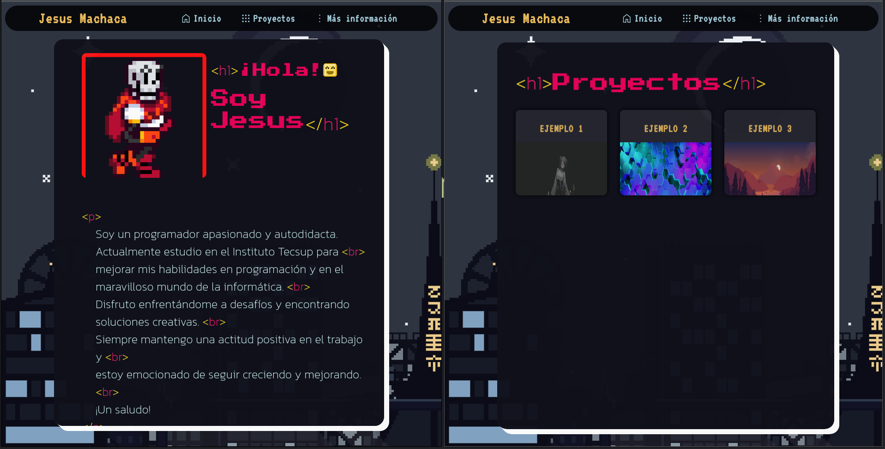

# Portafolio Personal de Ejemplo (Lado del Cliente).

### **Este es un ejemplo del lado del cliente mi portafolio personal**
---
### Nota:
En este repositorio solo subí la parte del cliente de mi portafolio.
Solo es una muestra de la interfaz,  puesto que el portalofio final
es un proyecto **Full Stack**, cuenta con **Backend** y **Frontend**. 
Lamentablemente el **código del Backend no estará disponible** en este repositorio por motivos de privacidad.    
Para más información acerca del proyecto visita mi canal de [TikTok](https://tiktok.com/@notjisas).  
Para visitar la página principal del portafolio aquí: [JsasMachaca](link no disponible hasta su despliegue).

---

# Tecnologias usadas en el Frontend:

| **N°**   | **Tecnologias**  |
|:--------:|:----------------:|
| 1        | HTML             |
| 2        | CSS              |
| 3        | JavaScript       |

# Tecnologias usadas en el Backend:

| **N°**   | **Tecnologias**  | **Versión** |
|:--------:|:----------------:|:-----------:|
| 1        | Python           | 2.3.2       |
| 2        | Mysql            | 11.0.2      |

